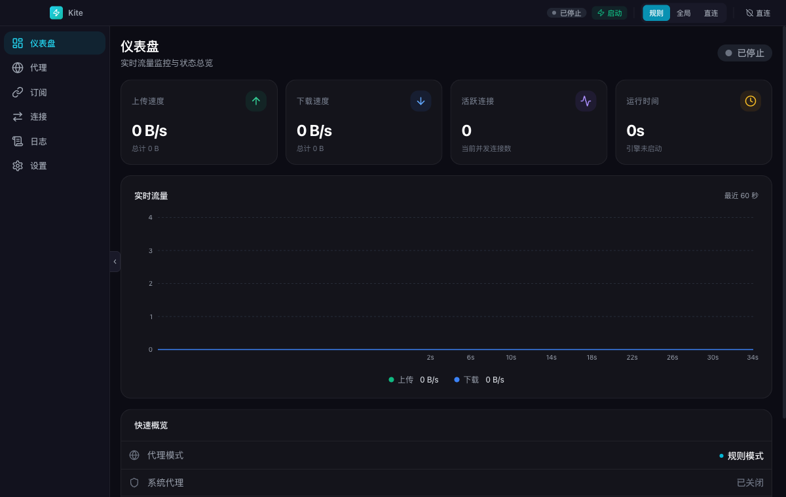
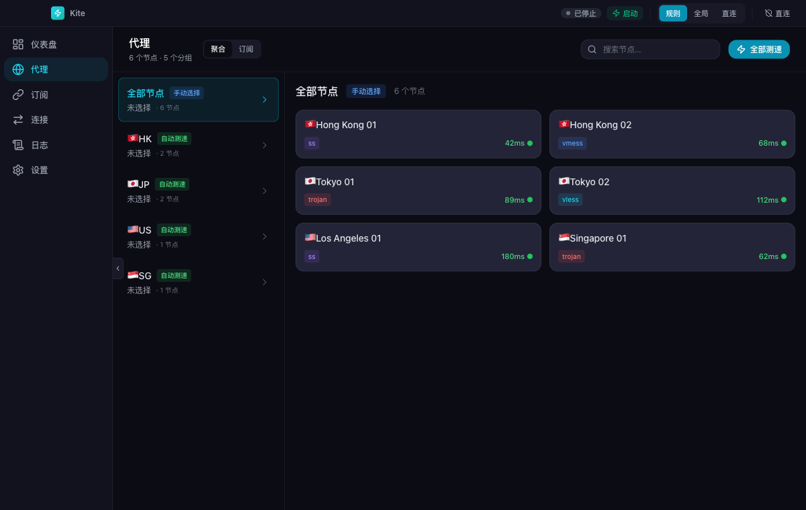
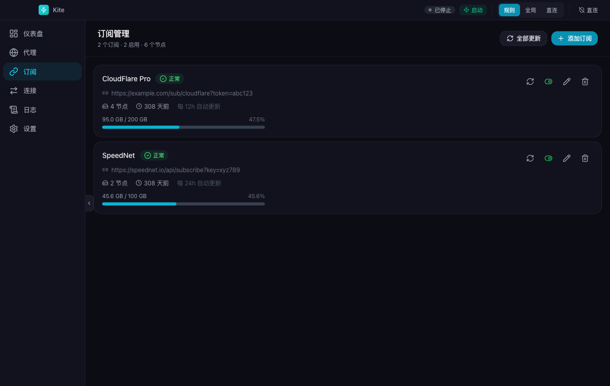
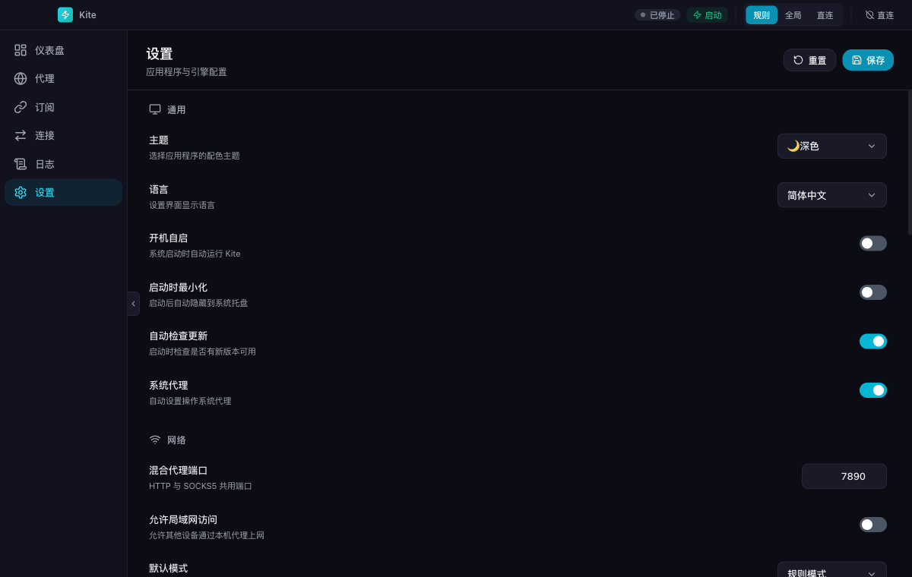

# Kite VPN

跨平台代理客户端，内置多订阅聚合。支持 macOS / Windows / Linux / Android。



## 特性

- **多订阅聚合** — 添加多个代理订阅，自动合并去重，按地区智能分组
- **8 种协议** — Shadowsocks / VMess / VLESS / Trojan / Hysteria2 / TUIC / WireGuard / SSR
- **引擎源码编译** — mihomo 引擎从 Go 源码编译打包，不下载第三方二进制
- **跨平台** — macOS / Windows / Linux 桌面端 + Android 移动端
- **开箱即用** — 首次启动引导流程，三步完成配置
- **自动更新** — 内置 Tauri updater，检测到新版本自动下载安装

## 截图

| 代理节点 | 订阅管理 | 设置 |
|---------|---------|------|
|  |  |  |

## 快速开始

### 下载安装

从 GitHub Releases 下载对应平台安装包：

- macOS Apple Silicon: `Kite_*_macOS-Apple-Silicon.dmg`
- macOS Intel: `Kite_*_macOS-Intel.dmg`
- Windows: `.exe` 或 `.msi`
- Linux: `.AppImage` / `.deb` / `.rpm`

macOS 包使用 Developer ID 签名，但当前未做 Apple notarization。首次打开时如果系统提示“Apple 无法验证 Kite”，这是 Gatekeeper 对未公证开源分发包的正常拦截，不代表安装包损坏。信任源码和发布来源后，可以在“系统设置 -> 隐私与安全”里选择“仍要打开”，或在 Finder 中右键点击 Kite 后选择“打开”。

### 环境要求

- Node.js >= 20
- pnpm >= 9
- Rust (stable)
- Go >= 1.22

### 开发

```bash
# 安装依赖
pnpm install

# 编译 mihomo 引擎（首次约 30 秒）
pnpm run build:engine

# 启动桌面端开发模式
pnpm run dev:desktop
```

### 构建

```bash
# 桌面端（当前平台）
pnpm run build:desktop

# 移动端 mihomo 引擎
pnpm --filter @kite-vpn/engine build:mobile

# Android
pnpm run dev:android
```

### 测试

```bash
pnpm test
```

## 项目结构

```
kite/
├── packages/
│   ├── types/      TypeScript 类型定义
│   ├── core/       核心逻辑（协议解析、订阅合并、配置生成）
│   ├── ui/         React + Tailwind 前端
│   └── engine/     mihomo Go 源码
├── apps/
│   ├── desktop/    Tauri 桌面端（macOS/Windows/Linux）
│   └── mobile/     Tauri 移动端（Android/iOS）
└── .github/
    └── workflows/  CI/CD（自动构建 + 自动发布）
```

## 发布

```bash
git tag v0.1.0
git push origin v0.1.0
```

GitHub Actions 自动构建 6 个平台并创建 Release。macOS Release 包会进行 Developer ID 签名并校验 bundle 签名完整性，但不会提交 Apple notarization。

## 技术栈

| 层 | 技术 |
|---|------|
| 前端 | React 19 + TypeScript + Tailwind CSS + Zustand + Recharts |
| 桌面端 | Tauri 2 (Rust) |
| 移动端 | Tauri 2 Mobile (Rust) |
| 代理引擎 | mihomo (Go, 源码编译) |
| 测试 | Vitest (26 个单元测试) |
| CI/CD | GitHub Actions |

## 协议

MIT
